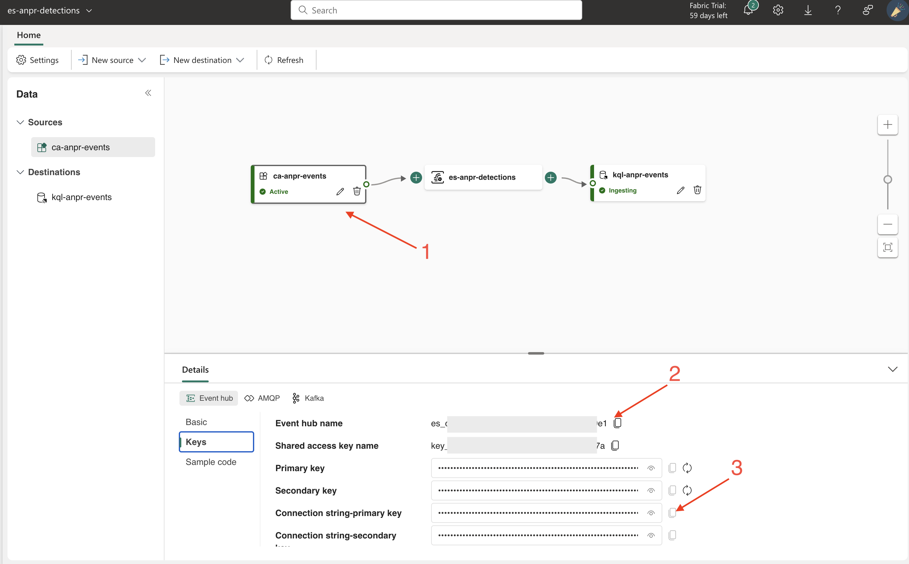

> https://github.com/computervisioneng/automatic-number-plate-recognition-python-yolov8

#Run the test data sample

Load the evironments variables. Replace the below values using a custom app in the evenstream with numbers 3 and 2 as shown in the below image




export FABRIC_ENDPOINT="Endpoint=sb://[esehwestuet*******].servicebus.windows.net/;SharedAccessKeyName=[key_******];SharedAccessKey=[*********];EntityPath=es_cbd35066-****-****-****-**************"
export FABRIC_ENTITY="es_cbd35066-****-****-****-**************"

# Run inference

> pip install -r requirements.txt

pip install Pillow==9.5.0


# Running the image:

Build the image:

```
docker rmi -f my-python-app ; docker build -t my-python-app . ; docker run -p 4000:80 my-python-app  
```

```
docker build -t my-python-app . --load
```

```
docker run -p 4000:80 my-python-app --env-file ./.env
```

# Troubleshooting

## Local run

### Initializing libomp.dylib, but found libomp.dylib already initialized.

Local MacOS env was erroring with 

> python main.py                            
> OMP: Error #15: Initializing libomp.dylib, but found libomp.dylib already initialized.
> OMP: Hint This means that multiple copies of the OpenMP runtime have been linked into the program. That is dangerous, since it can degrade performance or cause incorrect results. The best thing to do is to ensure that only a single OpenMP runtime is linked into the process, e.g. by avoiding static linking of the OpenMP runtime in any library. As an unsafe, unsupported, undocumented workaround you can set the environment variable KMP_DUPLICATE_LIB_OK=TRUE to allow the program to continue to execute, but that may cause crashes or silently produce incorrect results. For more information, please see http://openmp.llvm.org/
> zsh: abort      python main.py

This seems to have pointed in the right direction (to avoid the not advisable solution above - which worked when set to TRUE)

https://stackoverflow.com/questions/53014306/error-15-initializing-libiomp5-dylib-but-found-libiomp5-dylib-already-initial

### The local sample and docker image can't find the source

The sample video is not included. Just include a video of any cars in the street from more or less close to have varying data and test that as input

## Docker

### Docker build issue with psutil failing to build


### ImportError: libGL.so.1: cannot open shared object file: No such file or directory

docker run -it my-python-app /bin/bash

docker exec -it container_id /bin/bash
